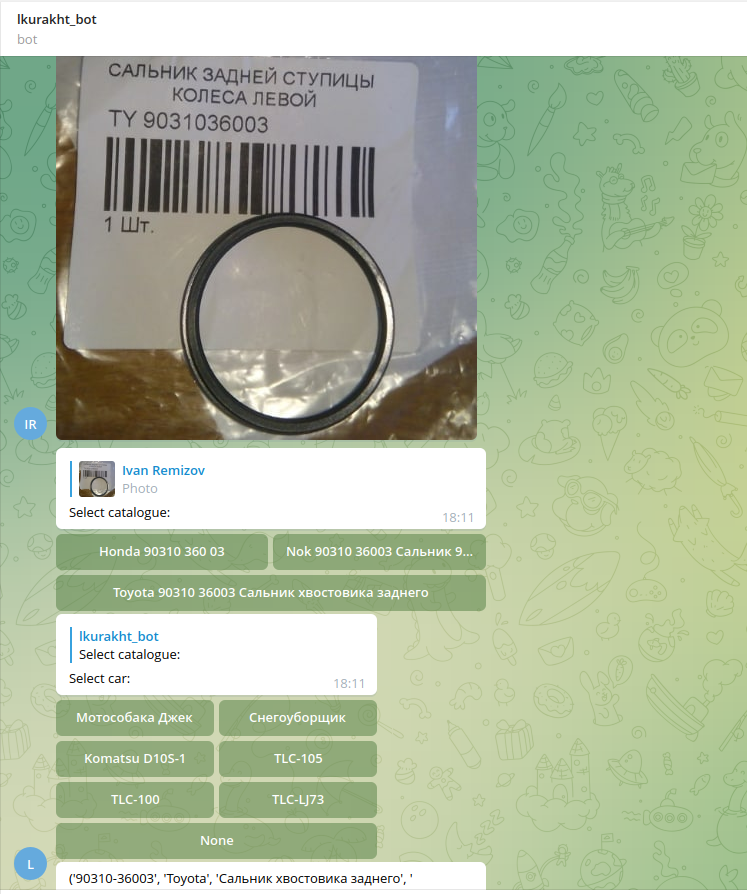
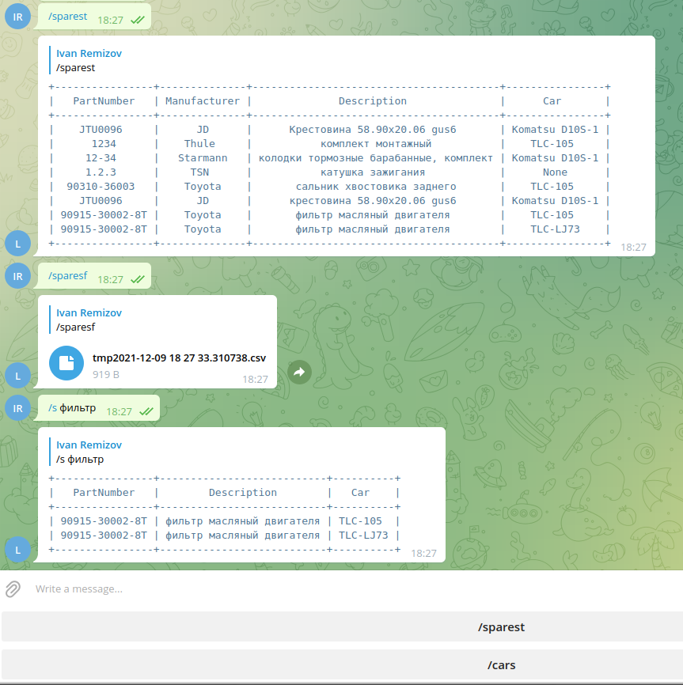

## Garage bot

`telegram` `bots` `aiogram` `aiohttp` `zbarimg` `sqlite3`

Для запуска бота следует положить telegram token в переменную среды BOT_TOKEN

В гараже очень много запчастей для разных машин, иногда в нескольких экземплярах. Разбросано это все по нескольким
помещениям, по десятку стеллажей и шкафов. Обычно, если мне надо произвести техобслуживание или ремонт машины, я,
потратив пару часов на поиски нужной запчасти (предварительно убедившись, что я такую запчасть точно заказывал и она
куплена), снова заказываю ее в магазине, в лучшем случае меняю, в худшем - кладу на какой-то стеллаж и откладываю до
следующей итерации.

Навести порядок с этим бардаком поможет бот, заполняющий базу запчастей. Каждая новая запчасть харакетризуется номером,
на ее упаковке. Сценарий использования предполагается следующий.

#### 1. Заполнение базы

Для каждой найденной запчасти ввожу номер с ее упаковки боту, либо фотографирую штрихкод с упаковки для распознавания
номера. Бот пытается найти запчасть по номеру, если запрашиваемый номер соответствует запчастям разных производителей,
предлагается выбор каталога.

Возможно назначить принадлежность запчасти автомобилю.

Возможна одновременная работа нескольких пользователей добавляющих запчасти, с запоминанием состояния пайплайна
формирования запроса для каждого пользователя

#### 2. Поиск запчасти

Возможен поиск запчасти по фрагменту названия, выдача всех запчастей в виде таблицы и выгрузка всей базы в csv-файл.

#### Проблемы

- Для распознавания 128-битных штрих-кодов картинка должна быть в хорошем качестве
- Табличный вывод списка запчастей может плохо отображаться на телефоне (съезжает форматирование при вертикальной
  ориентации из-за недостаточной ширины)

#### Дальнейшеее развитие

Изначально планировалось для запчасти сразу добавлять место хранения запчасти (
номер стеллажа, номер полки). Сейчас это кажется не очень удобным, т.к. запчастей много и их надо быстро добавлять в
базу. Проще ввести административные меры, например, привязать стеллаж к автомобилю, полки разделить по типу запчастей:
фильтры, подшипники, сальники и т.д. В таком случае после внесения всех запчастей в БД с одновременным их размещением
на соответствующих полках возможно быдет заполнить их места хранения.

### Команды:

- /help - вывести справку
- /cars - вывести список машин
- /sparest - вывести список запчастей в табличеном виде
- /sparesf - вывести список запчастей в виде csv-файла
- /addcar <название машины>- купил очередную трахому? давай добавим в базу
- /s <текст запроса> - поиск запчасти в гараже по названию
- /a <номер запчасти> - добавить запчасть с номером
- При посылки фотографии бот попробует сам распознать штрих-код запчасти

#### Добавление по фото

#### Отображение базы, поиск

